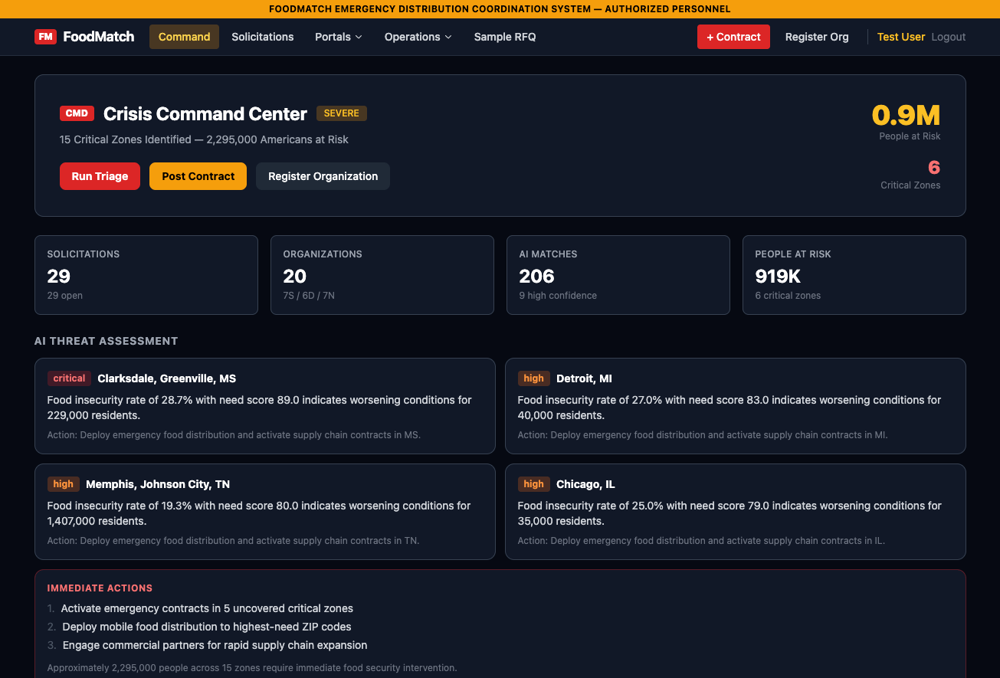
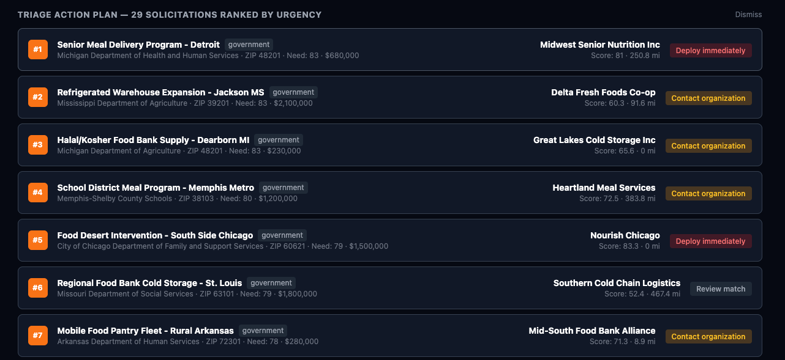
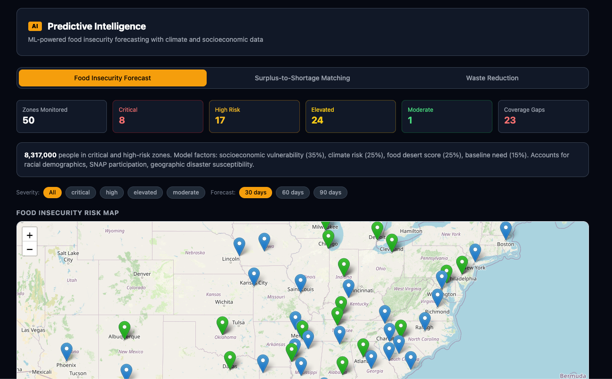
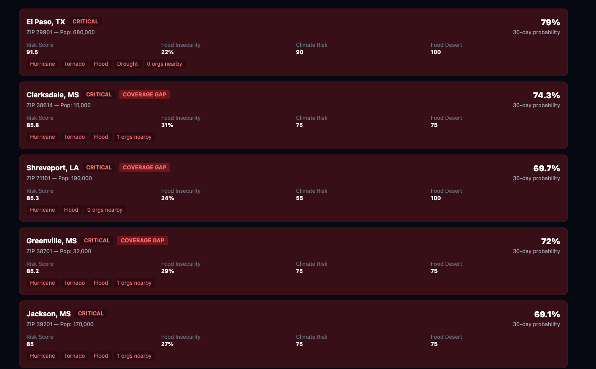

# FoodMatch

AI-powered crisis response platform that matches food distribution needs with qualified organizations during catastrophic emergencies.

## What problem does this project solve?

When disasters strike — hurricanes, pandemics, supply chain collapses — 40+ million food-insecure Americans face immediate danger. The bottleneck isn't food supply; it's **coordination**. Government agencies post solicitations, organizations have capabilities, but there's no fast way to match them. FoodMatch uses AI to instantly connect the right organizations to the right needs, prioritizing the highest-risk communities first.

## What libraries and services did we use?

- **OpenAI GPT-4o-mini** — Scores every match with contextual understanding of capabilities, certifications, proximity, and community need. Also powers the AI crisis forecast and threat assessment.
- **Flask + SQLAlchemy** — Python backend with RESTful API
- **React 19 + Vite + Tailwind CSS** — Fast, responsive frontend with dark crisis-themed UI
- **Leaflet.js** — Interactive map visualization of food insecurity zones, solicitations, and organizations
- **PostgreSQL** (production) / **SQLite** (development) — Database with real US food insecurity data
- **Render** — Free-tier cloud deployment

## What did we build?

- **AI Match Engine** — 4-component scoring system (capability overlap 30%, proximity 20%, need score 20%, LLM score 30%) that evaluates every organization against every solicitation
- **Triage Mode** — One-click batch matching across ALL open solicitations, ranked by urgency. The AI processes highest-need zones first and returns deploy/contact/expand recommendations
- **Crisis Forecast** — GPT-4o-mini analyzes real food insecurity data across monitored zones and generates threat-level assessments with predictions and immediate action items
- **Crisis Dashboard** — Real-time command center with interactive map, risk alerts, coverage gap detection, and population-at-risk tracking
- **Role-Based Portals** — Separate views for federal agencies, suppliers, and distributors
- **Predictive Analytics** — Food insecurity trend forecasting with demand prediction models
- **Emergency Capacity Tracking** — Monitor and manage emergency food distribution resources
- **Full Marketplace** — Government and commercial solicitations, organization registration, JWT authentication

## What would we improve next?

Real-time data ingestion from USDA, FEMA, and state-level food insecurity feeds instead of seeded data. Push notifications when a zone crosses a critical threshold. A mobile-first field deployment view for on-the-ground responders. WebSocket-based live updates so the dashboard reflects changes instantly during an active crisis.

## Set Up Instructions

### Backend

```bash
cd hackthon-2026/backend
python -m venv venv
source venv/bin/activate
pip install -r requirements.txt
```

Create a `.env` file:
```
OPENAI_API_KEY=sk-your-key-here
```

Seed the database and run:
```bash
python scripts/seed.py
python run.py
```

Backend runs on `http://localhost:5000`.

### Frontend

```bash
cd hackthon-2026/frontend
npm install
npm run dev
```

Frontend runs on `http://localhost:5173` with API proxy to the backend.

**Note:** The app works without an OpenAI API key — all AI features have deterministic fallbacks.

## Screenshots






## Collaborators

- [10thoesam](https://github.com/10thoesam)
- [maremi09](https://github.com/maremi09)
- [buitano](https://github.com/buitano)
